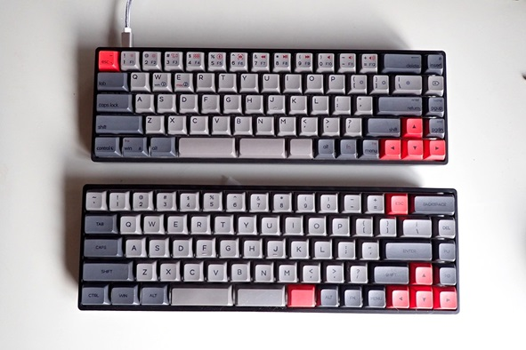
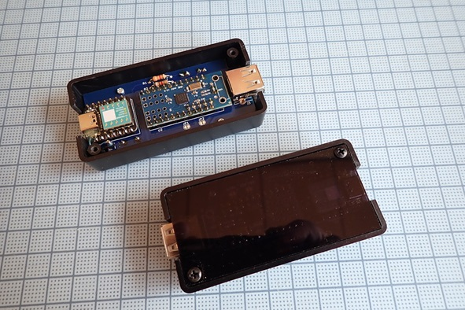

# Gallery

## SKYLOONG GK68 Lite / GK68X Keyboard

## RP hoboNicola. XIAO RP2040 using PICO-PIO-USB library.

※この基板は[PCBWayのShared Project](https://www.pcbway.com/project/shareproject/hoboNicola_for_XIAO_RP2040_85b65544.html?fbclid=IwAR2sAHvLnuXRiQwWyAOBNxl92dvUmLA880vfrMHIG3NbP6EjIKG7mfLd4YQ)に登録しています。

## USB hoboNicola. Seeduino XIAO-m0 and mini USB Host Shield V2.

[戻る/Back](../README.md)